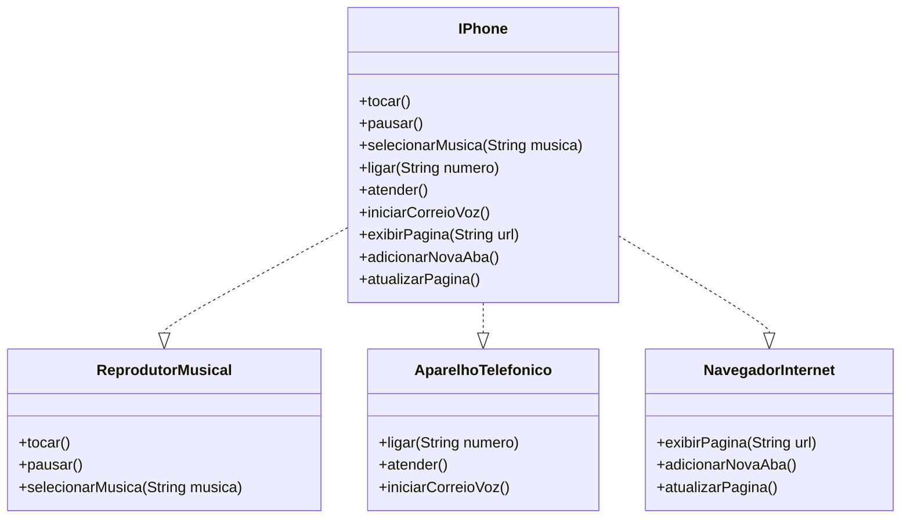

# Desafio POO – iPhone

## 1. Objetivo
Modelar e diagramar, em UML, o componente **iPhone** com três funcionalidades principais (Reprodutor Musical, Aparelho Telefônico e Navegador de Internet) e, opcionalmente, implementar essas interfaces em Java.

## 2. Requisitos Funcionais
- **Reprodutor Musical**
  - `tocar()`
  - `pausar()`
  - `selecionarMusica(String musica)`
- **Aparelho Telefônico**
  - `ligar(String numero)`
  - `atender()`
  - `iniciarCorreioVoz()`
- **Navegador na Internet**
  - `exibirPagina(String url)`
  - `adicionarNovaAba()`
  - `atualizarPagina()`

## 3. Estrutura do Projeto

```plaintext
src/
├── interfaces/
│   ├── ReprodutorMusical.java
│   ├── AparelhoTelefonico.java
│   └── NavegadorInternet.java
├── model/
│   └── IPhone.java
└── Main.java
```


- **interfaces/**: definem contratos para cada funcionalidade.
- **model/IPhone.java**: implementa todas as interfaces.
- **Main.java**: testa chamadas às três funcionalidades.

## 4. Diagrama UML (Mermaid)


---
## Autor
**Julio Neri** – [github.com/julioneri](https://github.com/julioneri)

## Licença
MIT License.

## Agradecimentos

- 🎓 Plataforma DIO pela proposta do desafio